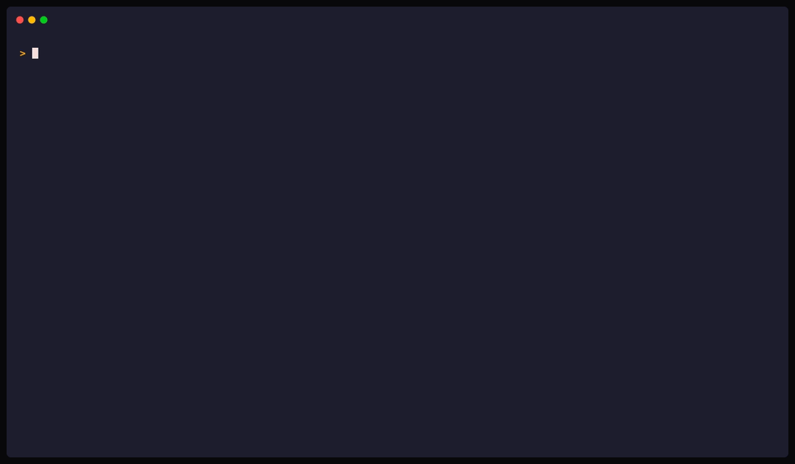

# Installation

Install gridctl on macOS, Linux, or WSL2. The recommended path is the one-liner installer; package managers and pre-built binaries are documented below for users who prefer them.

## Quick install (macOS, Linux, WSL2)

```bash
curl -fsSL https://raw.githubusercontent.com/gridctl/gridctl/main/install.sh | sh
```

Installs the latest release to `~/.local/bin/gridctl`. The script verifies the release checksum and prints the install path and next steps.

A checksum downloaded with an archive detects corruption but does not independently authenticate its origin. To authenticate a covered release before extraction or installation, use the [external verification procedure](release-verification.md). The installer, updater, and Homebrew do not automatically enforce attestation verification.

The script can be inspected before running:

```bash
curl -fsSL https://raw.githubusercontent.com/gridctl/gridctl/main/install.sh | less
```

> **Windows**: install [WSL2](https://learn.microsoft.com/en-us/windows/wsl/install), then run the command above inside your Linux distribution.



## Package managers

<details>
<summary><strong>Homebrew</strong> (macOS, Linux)</summary>

```bash
brew install gridctl/tap/gridctl
```

Update with `brew upgrade gridctl/tap/gridctl`.

</details>

## Other options

<details>
<summary><strong>Pre-built binaries</strong></summary>

Download the tarball for your platform from the [releases page](https://github.com/gridctl/gridctl/releases). For a provenance-covered release, [authenticate the archive](release-verification.md#verify-before-installing) before extracting it, then install those same local bytes. `checksums.txt` remains available for corruption checks but does not independently authenticate origin. The verification guide describes legacy-release coverage and Linux/macOS architecture selection.

</details>

<details>
<summary><strong>Build from source</strong></summary>

Requires Go 1.26+, Node 22+ (pinned in `.nvmrc` and `web/package.json` engines), and [Task](https://taskfile.dev/docs/installation).

```bash
git clone https://github.com/gridctl/gridctl
cd gridctl && task build
./gridctl --help
```

</details>

## Updating

```bash
gridctl upgrade            # check + prompt + upgrade (standalone install)
gridctl upgrade --check    # only check; do not install
gridctl upgrade --yes      # non-interactive (CI)
gridctl upgrade --version v0.1.0-beta.14   # install a specific version
```

If gridctl was installed via Homebrew, `gridctl upgrade` detects that and recommends `brew upgrade gridctl/tap/gridctl` instead.

Updating does not automatically verify attestations. To require origin verification for a standalone update, follow [Release Verification](release-verification.md) and install the verified local archive instead of asking `gridctl upgrade` to download it again.

## Uninstalling

Before removing the binary, remove what gridctl placed elsewhere on the
machine: projected skills and rules in client directories, gateway
entries in client MCP configs, and running containers. The installer's
`--purge` removes only `~/.gridctl` and leaves all of that behind:

```bash
gridctl reset --purge
```

Then remove the binary. (A planned follow-up may teach `install.sh --purge` to
invoke `gridctl reset --purge` itself while the binary is still on PATH; today
the installer does not, so run reset yourself first as shown above.)

```bash
# Standalone install
curl -fsSL https://raw.githubusercontent.com/gridctl/gridctl/main/install.sh | sh -s -- --uninstall

# Also remove the config directory at ~/.gridctl
# (redundant after `gridctl reset --purge`; if reset was skipped, this
# removes ONLY ~/.gridctl and strands projections and client-config
# entries)
curl -fsSL https://raw.githubusercontent.com/gridctl/gridctl/main/install.sh | sh -s -- --uninstall --purge

# Homebrew install
brew uninstall gridctl/tap/gridctl
```

## Migrating an existing MCP setup

If your clients (Claude Desktop, Cursor, VS Code, and others) already carry MCP server definitions, you do not need to re-type them into stack.yaml:

```bash
gridctl import                # Scan all detected clients, pick servers interactively
gridctl import cursor         # Import from one client
gridctl import --all --dry-run  # Preview everything without writing
```

The scan is read-only on client configs; the only file modified is your stack file, which is backed up first. Identical servers found in several clients are imported once (their provenance is shown), entries pointing at the gridctl gateway itself are filtered out, and plaintext secret-looking env values are offered into the encrypted variable store as `${var:KEY}` references. After importing, run `gridctl apply` to deploy and `gridctl link` to point the clients at the gateway.

## Isolated and CI installs

`GRIDCTL_HOME` (or the `--home <dir>` global flag) replaces the home directory every gridctl path derives from: `~/.gridctl` and the client projection targets alike. `GRIDCTL_HOME=/tmp/demo gridctl apply` runs a fully isolated instance that cannot touch real client configs, which is the right shape for CI jobs, demos, and trying gridctl without committing your machine to it. `gridctl doctor` reports the active home and its source. See [Home directory override](cli-reference.md#home-directory-override) for the full semantics.

## Container runtime

Gridctl requires a container runtime for workloads that run in containers (MCP servers with `image` or `source`, and resources). Generated Python source builds run entirely through Docker or Podman and do not require host Python or uv. Docker is detected by default; [Podman](https://podman.io) is also fully supported.

### Runtime detection

Gridctl auto-detects your runtime by probing sockets in this order:

1. `$DOCKER_HOST` (if set)
2. The active Docker CLI context (unix endpoints only)
3. `/var/run/docker.sock` (Docker)
4. `/run/podman/podman.sock` (Podman rootful)
5. `$XDG_RUNTIME_DIR/podman/podman.sock` (Podman rootless)

Step two mirrors the Docker CLI's own resolution, so context-based setups like OrbStack, Colima, and Rancher Desktop work without exporting `DOCKER_HOST`.

Override detection with the `--runtime` flag or `GRIDCTL_RUNTIME` environment variable:

```bash
gridctl apply stack.yaml --runtime podman
# or
GRIDCTL_RUNTIME=podman gridctl apply stack.yaml
```

### Using Podman

```bash
# Install Podman (macOS)
brew install podman
podman machine init
podman machine start

# Install Podman (Linux)
sudo apt install podman        # Debian/Ubuntu
sudo dnf install podman        # Fedora/RHEL

# Enable the Podman socket (Linux rootless)
systemctl --user enable --now podman.socket

# Verify gridctl detects Podman
gridctl info
```

Podman 4.0+ is required for rootless multi-container networking (netavark + aardvark-dns). Podman 4.7+ is recommended for full `host.containers.internal` support. Older versions fall back to the Docker-compatible `host.docker.internal` alias. SELinux volume labels (`:Z`) are applied automatically when Podman is running on an SELinux-enforcing system.

---

Back to the [docs index](README.md) or the [project README](../README.md).
